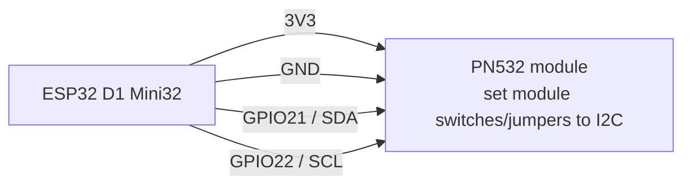
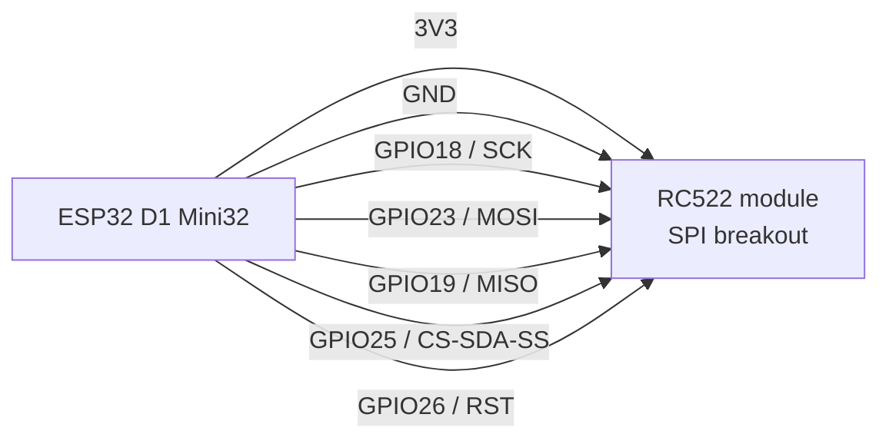
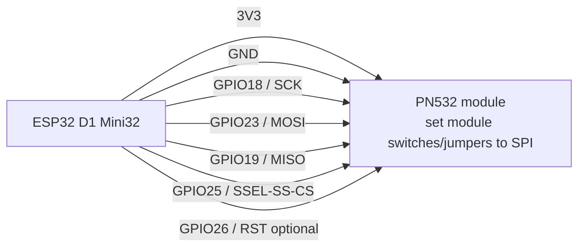

# NFC Readers On ESP32 D1 Mini32

Use the ESP32-WROOM-32 D1 Mini clone as the lightweight Communifarm NFC reader controller. This wiring plan separates the field scanner from writer experiments so harvest/check-in stays boring and reliable.

| Build | Reader | Role | Preferred bus | Status |
| --- | --- | --- | --- | --- |
| Mobile scanner | PN532 | Scan existing NFC tags only | I2C | Recommended first build |
| Wired bench station | PN532 | Read/write NDEF payload tests | I2C or SPI | Recommended writer path |
| Wired bench station | RC522 | UID read / firmware R/W experiments | SPI | Hardware can R/W, ESPHome path is UID/read-oriented |
| Wireless test reader | RC522 | Portable read testing | SPI | Same pins as wired RC522; power budget still unverified |

## Board Pins Used

| Signal | D1 Mini32 pin | GPIO | Why this pin |
| --- | --- | --- | --- |
| I2C SDA | `D2` / `SDA` / `IO21` | `GPIO21` | Safe first-pick I2C data pin |
| I2C SCL | `D1` / `SCL` / `IO22` | `GPIO22` | Safe first-pick I2C clock pin |
| SPI MOSI | `D7` / `MOSI` / `IO23` | `GPIO23` | Safe first-pick VSPI MOSI |
| SPI MISO | `D6` / `MISO` / `IO19` | `GPIO19` | Safe first-pick VSPI MISO |
| SPI SCK | `D5` / `SCK` / `IO18` | `GPIO18` | Safe first-pick VSPI clock |
| NFC chip select | `IO25` | `GPIO25` | Avoids strap pin `GPIO5` |
| NFC reset | `D0` / `IO26` | `GPIO26` | Safe output for optional reset line |
| Power | `3V3` | 3.3 V | NFC module logic supply unless the module documentation says otherwise |
| Ground | `GND` | Ground | Common ground required |

Do not use `GPIO6` through `GPIO11`; those are tied to flash. Avoid `GPIO0`, `GPIO2`, `GPIO5`, `GPIO12`, and `GPIO15` for NFC control lines unless a specific module has been tested not to disturb boot.

## Wiring Diagram: PN532 Mobile Scanner

PN532 is the better mobile scanner because I2C keeps the cable simple and leaves the SPI bus free for later bench gear.

| PN532 signal | D1 Mini32 connection |
| --- | --- |
| `VCC` / `3V3` | `3V3` |
| `GND` | `GND` |
| `SDA` | `GPIO21` |
| `SCL` | `GPIO22` |
| `IRQ` | Leave unconnected for the first ESPHome polling build |
| `RSTO` / `RSTPD_N` | Leave unconnected first; use `GPIO26` only if the module needs explicit reset |

## Wiring Diagram: RC522 SPI Reader

Most low-cost RC522 breakout boards expose SPI. Use a safe, non-strap chip-select instead of the common `GPIO5` default.

| RC522 signal | D1 Mini32 connection |
| --- | --- |
| `3.3V` | `3V3` |
| `GND` | `GND` |
| `SCK` | `GPIO18` |
| `MOSI` | `GPIO23` |
| `MISO` | `GPIO19` |
| `SDA` / `SS` / `CS` | `GPIO25` |
| `RST` | `GPIO26` |
| `IRQ` | Leave unconnected |

## Wiring Diagram: PN532 Bench Writer Over SPI

Use this only if you want the bench writer on SPI. For first R/W experiments, PN532 is preferable to RC522 because ESPHome documents NDEF read/write examples for PN532.

## Firmware Notes

| Need | Suggested path |
| --- | --- |
| Mobile scan into Communifarm | PN532 I2C, publish UID or Home Assistant tag scan. Communifarm resolves UID to stable object. |
| Write NDEF payloads | PN532 first. ESPHome PN532 has NDEF read and write examples. |
| RC522 basic scans | ESPHome `rc522_spi` can read tag UIDs and trigger automations. |
| RC522 writes | Treat as custom-firmware work until proven. Do not build the Communifarm production workflow around RC522 write support yet. |

Tags should contain stable references only, such as `cf://batch/<stable-id>`, `cf://lot/<stable-id>`, or `cf://asset/<stable-id>`. Do not encode mutable stage, location, harvest count, or inventory quantity on the physical tag.

## Bring-Up Checklist

| Step | Check |
| --- | --- |
| 1 | Confirm the exact PN532/RC522 module silkscreen and voltage markings before soldering. |
| 2 | Power from USB first; connect all module `GND` pins to board `GND`. |
| 3 | Flash a minimal ESPHome config with only Wi-Fi/API/logger and the NFC component. |
| 4 | Scan one known tag and confirm the UID appears in logs before integrating with Communifarm services. |
| 5 | For wireless RC522, measure current draw before assuming useful battery life. This D1 Mini32 clone is a bench board, not a low-power board. |

## Sources

- Internal board profile: `docs/hardware/esp32-wroom-32-d1-mini-clone.md`
- Internal NFC process model: `repos/communifarm/docs/process/nfc-harvest-checkin.md`
- ESPHome `rc522` component documentation: UID reads over SPI/I2C.
- ESPHome PN532 component documentation: UID reads plus NDEF read/write examples over SPI/I2C.
